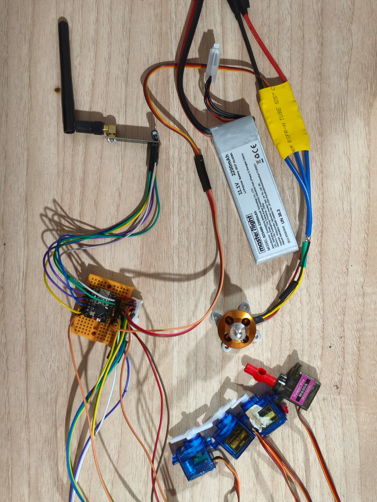

# ESP32 RC Plane

<p align="center">
  
</p>

A from-scratch radio control system for a fixed-wing aircraft, built on two ESP32 boards
instead of a commercial TX/RX pair. There is no hobby transmitter in this project: the
ground station generates the RC frame itself, and the aircraft decodes it, drives the
surfaces and reports back — over a **redundant dual radio link** with failsafe logic on
both ends.

The interesting part of this build is not that it moves a servo. It is everything that
happens when the link degrades: duplicate suppression, arm interlocks, relink hysteresis
and independent throttle ceilings on both sides.

## 🛰️ System Overview

```
┌──────────────────────────────┐            ┌──────────────────────────────┐
│  GROUND STATION (TX)         │            │  AIRCRAFT (RX)               │
│  ESP32-WROOM-32              │            │  ESP32-C3 SuperMini          │
│                              │            │                              │
│  WiFi AP ──► web UI          │  RcPacket  │  paketIsle()                 │
│  192.168.4.1   ┌──────────┐  │ ══ 50 Hz ═►│  ├─ verify (magic + CRC)     │
│                │ nRF24L01 │──┼─ 2.508 GHz │  ├─ arm interlock            │
│                └──────────┘  │            │  ├─ failsafe                 │
│                ┌──────────┐  │            │  └─ LEDC ──► ESC + 4 servos  │
│                │  ESP-NOW │──┼─ 2.412 GHz │                              │
│                └──────────┘  │◄═ telemetry│  RcTelemetry (8 B)           │
└──────────────────────────────┘            └──────────────────────────────┘
```

The operator's phone connects to the ground station's own access point and flies the
aircraft from a browser — sliders and keyboard, no internet, no pairing app. The ground
station turns that into a 12-byte `RcPacket` at 50 Hz and pushes it over the air.

## 📡 Redundant Dual Transport

The same `RcPacket` travels over **two fully independent radio paths**, and either one
alone is enough to fly:

| | nRF24L01+ | ESP-NOW |
|---|---|---|
| Hardware | Separate module, SPI, 7 wires + capacitor | **None** — the chip's own WiFi radio |
| Frequency | 2.508 GHz (channel 108) | 2.412 GHz (WiFi channel 1) |
| Addressing | `"RCP01"` pipe | Learned unicast, no MAC pairing needed |
| Telemetry | ACK payload | Separate unicast frame |

The 96 MHz gap between the two is deliberate — the access point cannot desensitise the
nRF24 link. Both paths funnel into the same `paketIsle()` entry point on the aircraft, so
validation, arming and failsafe rules exist in exactly one place and cannot drift apart.
When a packet arrives twice, the `seq` delta is 0 and the duplicate is dropped: outputs are
never written twice and telemetry is never sent twice.

This redundancy was not academic. The nRF24 path was dead for a stretch during bring-up
(brown-out on transmit, and a clone chip silently refusing 250 kbps) — ESP-NOW kept the
aircraft controllable while that was diagnosed.

## 🛡️ Safety Architecture

Every guard below is enforced **independently on both boards**. Trusting the transmitter's
limits alone means a corrupted packet or a stale browser tab can spin a propeller.

* **Arm interlock.** The aircraft boots arm-locked and re-locks after every failsafe. It
  will not arm until it has seen a packet with `ARMED = 0` from the ground station — so a
  recovering link can never spin the motor on its own; the operator must cycle DISARM → ARM.
* **Telemetry-gated arming.** The ground station refuses to arm unless fresh telemetry is
  coming back from the aircraft. The "controller says ARMED but the aircraft never heard it"
  state is structurally impossible.
* **Two-stage throttle ceiling.** `THROTTLE_MAX_US` exists in both firmwares and is applied
  twice. Bench testing runs at 1200 µs long before anything is trusted at 2000.
* **Failsafe.** No valid packet for 500 ms → throttle to 1000 µs, all surfaces to neutral,
  arm dropped.
* **Relink hysteresis.** Leaving failsafe requires 10 consecutive valid packets (~200 ms at
  50 Hz). Recovering on a single packet made the motor stutter every time the link twitched.
* **Browser watchdog.** The web UI polls every 100 ms, and that poll *is* the watchdog feed.
  Close the tab or walk out of WiFi range and the ground station disarms within 1 second,
  with the aircraft's own failsafe firing 500 ms later.
* **CRC-8 on every frame**, on top of the nRF24's hardware CRC-16, plus a protocol version
  nibble so mismatched firmware cannot half-work.

## ⚡ Hardware

<p align="center">
  
  
</p>

**Aircraft — ESP32-C3 SuperMini.** Chosen for mass, not compute: it carries the whole
receive-and-actuate loop in a footprint that does not disturb the CG. Its GPIO matrix lets
SPI land on any free pin, which matters on a part with this few usable pins.

**Ground station — ESP32-WROOM-32.** Runs the WiFi access point, the web server and the
radio at the same time. The dual-core part keeps HTTP work from stalling the 50 Hz frame.

**nRF24L01+ with an external SMA antenna at both ends**, running at `RF24_PA_HIGH`. If a
module resets under load, drop it to `RF24_PA_LOW` before suspecting anything else.

**Power.** 3S 2200 mAh LiPo → ESC → brushless outrunner. Servos and ESC run from a separate
5 V UBEC, never the board regulator: a 9 g servo pulls ~700 mA on a step input and will
brown out the MCU. Grounds are common. The ground station runs off an 18650 pack in a
3D-printed enclosure.

> ⚠️ **The nRF24 needs a 10–100 µF capacitor across VCC–GND, as close to the module pins as
> possible.** Without it the module browns out during transmit and `radio.begin()` succeeds
> only sometimes — the most misleading failure mode in this whole build.
>
> ⚠️ **nRF24 VCC is 3.3 V, never 5 V.** The header is 2×4 with GND on pin 1 and VCC on pin 2;
> it is very easy to be one row off, and reversed supply kills the module.

### Pin map

| Aircraft (ESP32-C3) | GPIO | | Ground station (ESP32) | GPIO |
|---|---|---|---|---|
| ESC signal | 0 *(10 k pulldown)* | | nRF24 CE | 4 |
| Aileron left / right | 1 / 3 | | nRF24 CSN | 5 |
| Elevator | 4 | | nRF24 SCK | 18 |
| Rudder | 21 | | nRF24 MISO | 19 |
| nRF24 SCK / MISO / MOSI | 5 / 6 / 7 | | nRF24 MOSI | 23 |
| nRF24 CSN / CE | 10 / 20 | | | |

GPIO 2, 8, 9 are strapping pins on the C3 and 18/19 are USB D±, so none of them are used.
The 10 k pulldown on the ESC line keeps the pin from floating garbage into the ESC during
boot. Full wiring notes, including cable colours, live in
**[docs/RF_PROTOCOL.md](docs/RF_PROTOCOL.md)**.

## 💻 Firmware

* **Direct LEDC servo driving — no `ESP32Servo`.** The library's pin allowlist rejects GPIO0,
  and its degree↔µs conversion shifted the neutral point. Writing LEDC duty directly means
  the firmware speaks the same unit as the wire protocol: microseconds, end to end, with no
  conversion anywhere.
* **The 14-bit C3 trap.** The ESP32-C3's LEDC timer maxes out at 14 bits, while nearly every
  example online uses 16 (valid on the classic ESP32). Copy those verbatim and `ledcSetup()`
  silently returns 0, no PWM is generated at all, and a multimeter reads 0 V on the pin.
  14 bits @ 50 Hz still gives ~1.22 µs resolution — well past what RC needs.
* **Non-blocking transmit.** The ground station uses `startWrite()` plus STATUS polling rather
  than `radio.write()`. Blocking writes burn ~12 ms of the 20 ms budget when the link drops,
  making the UI sluggish exactly when control matters most. A transmit exceeding 15 ms is
  aborted and the TX FIFO flushed.
* **Unicast telemetry.** The downlink was originally broadcast; broadcast frames go out at the
  lowest rate, unacknowledged and unretried, and can be filtered at the receiver — uplink
  worked while the downlink quietly died. The aircraft now learns the ground station's MAC
  from the first packet and answers unicast, which is acknowledged at the MAC layer.
* **Decoupled telemetry cadence.** Telemetry refreshes every 100 ms regardless of packet
  arrival, so duplicate-suppression gaps can't be misread as "the aircraft is not answering".
* **ESC throttle range calibration**, triggered by pressing `k` on the serial port within
  5 seconds of boot. An uncalibrated ESC can still read 1200 µs as stop — the usual cause of
  "throttle is going out but the motor won't turn". The routine deliberately exceeds
  `THROTTLE_MAX_US`, so it is never reachable from flight code.
* **Self-healing radio.** Both sides retry `radio.begin()` every 3 s and report link state
  from a live register read, so a wire reseated mid-session recovers without a reset.

## 🚀 Getting Started

### Prerequisites
* [PlatformIO](https://platformio.org/)
* Libraries are pulled automatically: `nrf24/RF24@^1.4.11`

### Build & flash

```bash
git clone https://github.com/erayfazilordanuc/rc-plane.git
cd rc-plane

# Aircraft
cd firmware/flight_software
pio run -t upload -t monitor

# Ground station
cd ../controller_software
pio run -t upload -t monitor
```

Both `platformio.ini` files **pin their serial port explicitly** (`COM6` for the aircraft's
native-USB C3, `COM5` for the CP210x bridge on the ground station). Without that, PlatformIO
takes the first port in the list and flashes the wrong board. Check yours with
`pio device list` and update the two lines.

### Fly it

1. Power the ground station and connect a phone to **`RC-Plane-TX`** / `rcplane1234`.
2. Open **`http://192.168.4.1`**.
3. Sliders for throttle / aileron / elevator / rudder — the surface sliders spring back to
   1500 µs on release, throttle stays put. Keyboard: `W`/`S` throttle, arrows for surfaces,
   `Space` for emergency stop.

Before a real flight, set `TEZGAH_MODU` (bench mode) to `false` in the ground station
firmware and confirm `THROTTLE_MAX_US` is 2000 on both sides. **Remove the propeller for
every bench test.**

## 🔧 Diagnostics

Two extra PlatformIO environments exist for isolating faults:

```bash
# Raw-SPI nRF24 diagnosis: shorts, MISO drive, pin-order permutations, speed sweep
cd firmware/controller_software
pio run -e rfdiag -t upload -t monitor

# Servo/ESC bench: no radio at all, drive the outputs from the serial port
cd firmware/flight_software
pio run -e bench -t upload -t monitor
```

`rfdiag` bypasses the RF24 library entirely and brute-forces all 12 SCK/MISO/MOSI and CE/CSN
combinations, so it reports the correct wiring order if the wires got swapped. If the
registers it reads are bit-shifted copies of each other, the MISO line is floating and the
module is not answering at all.

## 📂 Directory Structure

* `/avionics` — circuit photographs of the airborne stack and the ground station.
* `/cad` — print-ready STLs for the ground station enclosure.
* `/docs` — the radio protocol report: packet layout, failsafe rules, wiring, bring-up order.
* `/firmware/flight_software` — aircraft receiver (ESP32-C3) plus the bench-test environment.
* `/firmware/controller_software` — ground station transmitter (ESP32), web UI and RF diagnostics.

<p align="center">
  
</p>

> The engineering deep-dive in [docs/RF_PROTOCOL.md](docs/RF_PROTOCOL.md) and the source
> comments are written in Turkish.

## 🧭 Status & Next Steps

The link, the web UI, failsafe and the full actuation chain work on the bench. Open items:

* **Battery telemetry** — `bataryaOku()` returns 0 today; the ground station's voltage field
  lights up as soon as a divider is wired to the ADC.
* **Airframe integration** — moving off the breadboard onto a soldered board and into the
  fuselage.
* **Physical sticks** — a gimbal-based transmitter to replace the browser UI as primary control.
* **Range testing** and PA level tuning under real separation.
