# ESP32 RC Plane

<p align="center">
  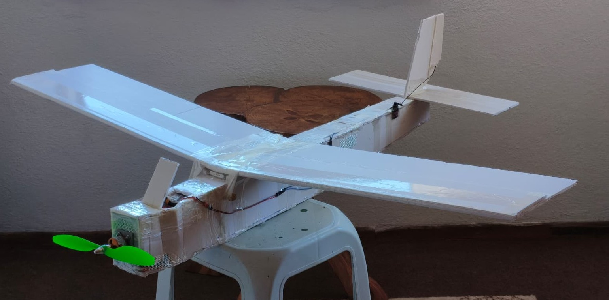
</p>

A from-scratch radio control system and airframe. There is no hobby transmitter in this
project: an ESP32 ground station builds the RC frame itself from a phone's touch sticks,
and an ESP32 in the aircraft decodes it, drives the surfaces and reports back — over a
**redundant dual radio link** with failsafe logic on both ends. The airframe is a 1.4 m
foam-board trainer, designed on paper and cut by hand. It flies, but not for long: no launch
has lasted more than about ten seconds — [what the tests showed and what I got
wrong](#-flight-tests).

It started as a way around a ~5000 TL transmitter/receiver set. But once the ground station
*is* the transmitter, arming, failsafe and throttle limits become my problem rather than a
radio manufacturer's — so the interesting part is not that a servo moves, it is everything
that happens when the link degrades.

* **Two independent radios, one code path** — nRF24L01+ and ESP-NOW carry the same frame;
  either alone can fly the aircraft.
* **Safety enforced on both boards** — arm interlock, two-stage throttle ceiling, 500 ms
  failsafe, relink hysteresis, browser watchdog.
* **Phone as transmitter** — WebSocket touch gimbals with no app and no internet, servo
  calibration over the air, stored in the aircraft's flash.
* **Tested without hardware** — a Node harness checks the UI's maths against the firmware
  at 42 000 points before anything is flashed.

<p align="center">
  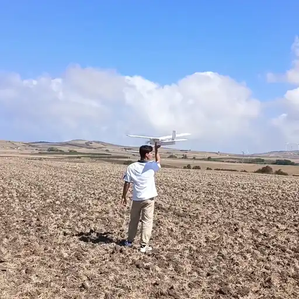
  <br><sub>First field test, 21 September 2026 — hand launch and the first seconds of the flight.</sub>
</p>

## 📐 Mechanics

<p align="center">
  
</p>

| | |
|---|---|
| **Construction** | 5 mm foam board, wooden spar, KFm-2 stepped airfoil, tape hinges |
| **Wing** | 1400 mm span, 200 mm constant chord, 28 dm², high wing, +1.4° incidence |
| **Control** | 3 channels — throttle, elevator, rudder; roll from rudder via 10° dihedral |
| **Tail** | 400 × 150 mm stabiliser (Vh 0.70), 180 mm fin (Vv 0.036) |
| **CG** | 278 mm from the firewall (measured): 48 mm behind the leading edge (24 %), just ahead of the spar |
| **Power** | A2212 1000 KV, 10×4.5 prop, 30 A ESC, 3S 2200 mAh 30C |
| **Weight** | 1106 g ready to fly, 39.5 g/dm² wing loading, thrust/weight ≈ 0.83 by eCalc (not measured) |

Tail volumes and CG are calculated, not guessed — thrust at flight speed was not, and that
is what the [flight tests](#-flight-tests) caught. Crashes are designed to be
cheap: the wing sits on **two dowels and rubber bands**, so a hard landing pops it off
instead of tearing the fuselage, and there is **no landing gear** — hand launch, belly
landing, sacrificial strip under the nose. The firewall and the ground station enclosure
are 3D-printed ([`cad/print_files/`](cad/print_files/)).

Every decision, the cut list, the weight budget and how the built aircraft differs from the
original plan: **[docs/AIRFRAME.md](docs/AIRFRAME.md)** (Turkish).

## 🔌 Electronics

```
┌──────────────────────────────┐            ┌──────────────────────────────┐
│  GROUND STATION (TX)         │            │  AIRCRAFT (RX)               │
│  WiFi AP ──► phone web UI    │  RcPacket  │  paketIsle()                 │
│  192.168.4.1   ┌──────────┐  │ ══ 50 Hz ═►│  ├─ verify (magic + CRC)     │
│                │ nRF24L01 │──┼─ 2.508 GHz │  ├─ arm interlock            │
│                └──────────┘  │            │  ├─ failsafe                 │
│                ┌──────────┐  │            │  └─ LEDC ──► ESC + 2 servos  │
│                │  ESP-NOW │──┼─ 2.412 GHz │                              │
│                └──────────┘  │◄═ telemetry│  RcTelemetry (8 B)           │
└──────────────────────────────┘            └──────────────────────────────┘
```

| | nRF24L01+ PA/LNA | ESP-NOW |
|---|---|---|
| Hardware | Separate module on VSPI, SMA antenna, `PA_HIGH` | **None** — the ESP32's own WiFi radio |
| Frequency | 2.508 GHz (channel 108) | 2.412 GHz (WiFi channel 1) |
| Addressing | `"RCP01"` pipe | Broadcast — no MAC pairing |
| Telemetry | ACK payload | Separate broadcast frame |

The 96 MHz gap is deliberate, so the access point cannot desensitise the nRF24. The
redundancy earned its place during bring-up: the nRF24 path was dead for a while (brown-out
on transmit, and a clone chip silently refusing 250 kbps) and ESP-NOW kept the aircraft
controllable while that was diagnosed.

### Ground station

<table>
<tr>
<td width="50%">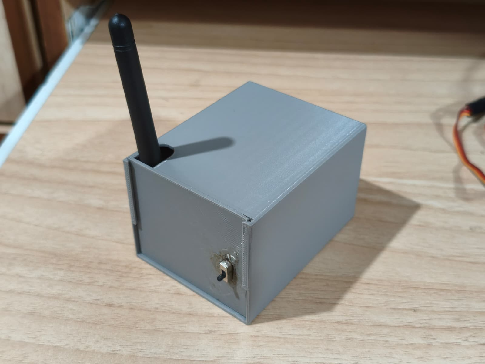</td>
<td width="50%">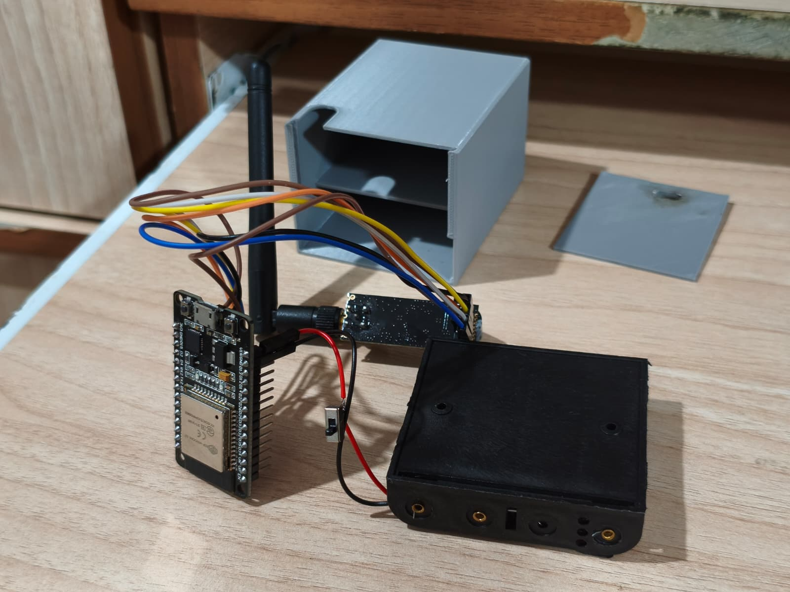</td>
</tr>
</table>

The handheld transmitter: an ESP32-WROOM-32 and the nRF24 in a 3D-printed, 18650-powered
box. Runs the WiFi access point, the web server and the 50 Hz radio frame at once — the
dual core keeps HTTP work from stalling the frame. This board *is* the transmitter.

<p align="center">
  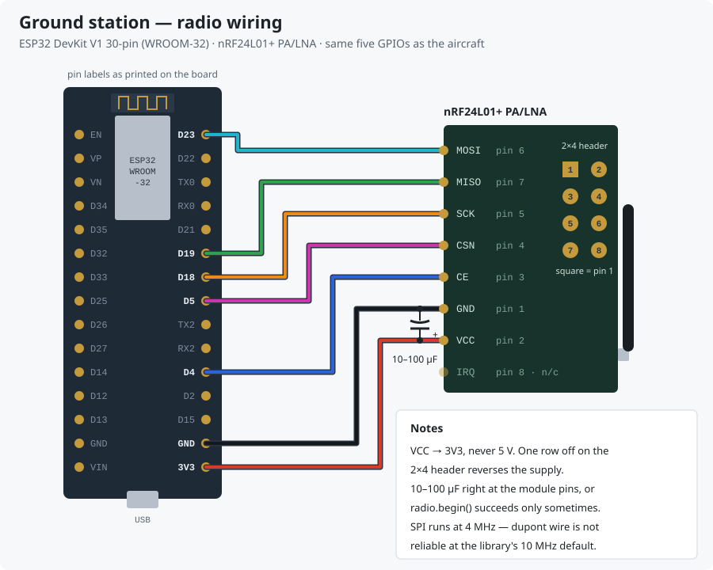
</p>

Radio pins: SCK 18, MISO 19, MOSI 23, CSN 5, CE 4 — the same map as the aircraft, so a wiring
fix on one board is a wiring fix on the other.

### Avionics

<table>
<tr>
<td width="50%">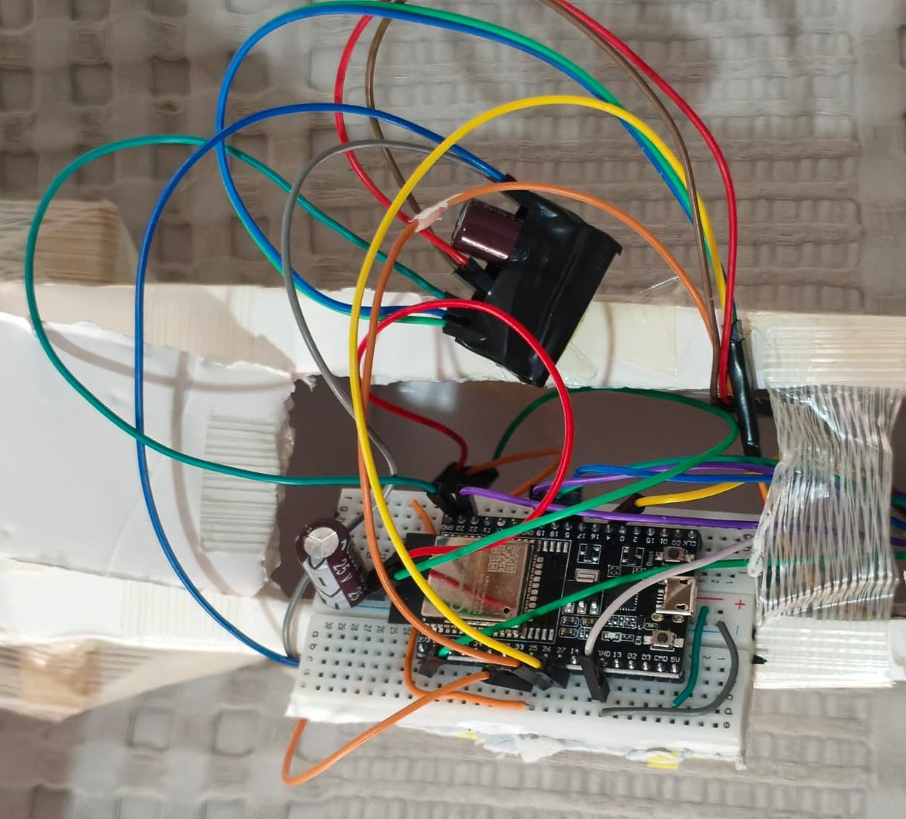</td>
<td width="50%">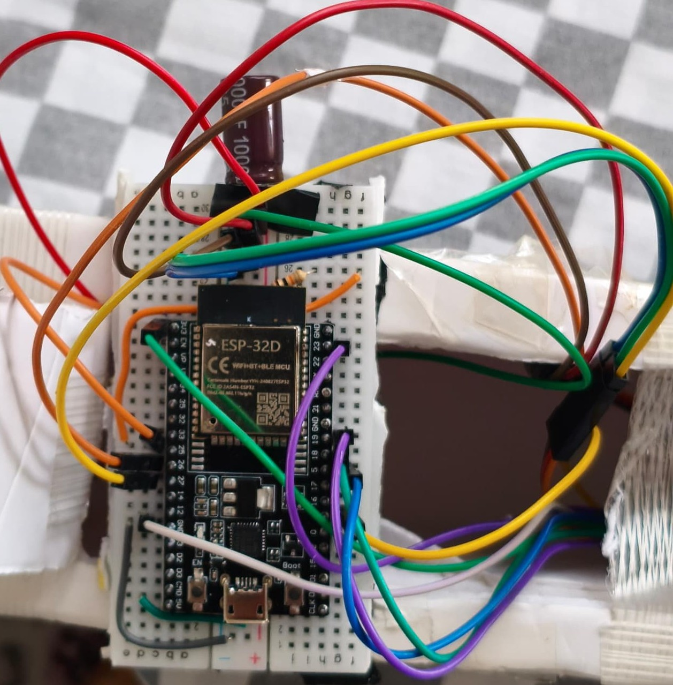</td>
</tr>
</table>

The flight controller: ESP32 DevKitC (WROOM-32D) inside the fuselage. Listens on both
radios, validates every frame, applies the stored calibration and drives the ESC and two
servos. Owns the failsafe, the arm lock and its own throttle ceiling, and sends telemetry
back.

**Power.** 3S LiPo → 30 A ESC → A2212, ≈ 15 A / 160 W at full throttle by eCalc. Moving the
servos used to crash the flight controller — first on the ESP32-C3 prototype, and again
after the move to the DevKitC. The cause was supply, not code: a 9 g servo pulls ~700 mA on
a step input, and the ESC's linear BEC, dropping 12 V to 5 V, could not hold the rail.
The fix was to disable that BEC and feed the board and servos from a **separate
5 V / 3 A UBEC** with a bulk capacitor across the rail; the crashes stopped. The boot log
prints the reset reason, so a returning `BROWNOUT` cannot hide.

<p align="center">
  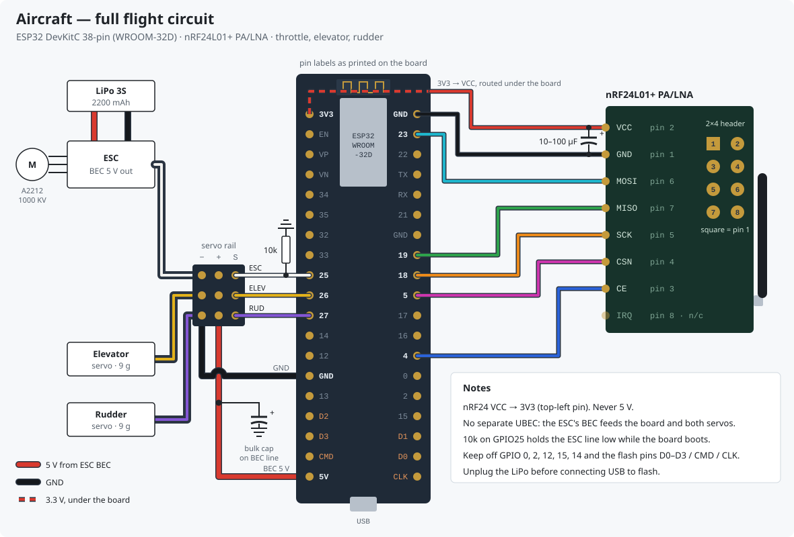
</p>

| Function | GPIO |
|---|---|
| ESC signal | 25 *(10 k to GND)* |
| Elevator / Rudder | 26 / 27 |
| nRF24 SCK / MISO / MOSI | 18 / 19 / 23 |
| nRF24 CSN / CE | 5 / 4 |

Strapping pins (0, 2, 12, 15), the boot-pulsing GPIO 14 and the flash pins (6–11) are all
avoided; the 10 k keeps the ESC line quiet while the board boots. GPIO 32/33 carry mirrored
aileron outputs for a future 4-channel wing.

> ⚠️ **nRF24: 3.3 V only, and a 10–100 µF capacitor right at the module pins.** Without it
> the module browns out on transmit and `radio.begin()` succeeds only sometimes — the most
> misleading failure in this build. The firmware counts every radio recovery, so a
> brown-out cannot hide.

Cable-colour wiring tables: each firmware's `docs/kablolama.html` and
**[docs/RF_PROTOCOL.md](docs/RF_PROTOCOL.md)**. Diagrams are generated by
[`docs/diagrams/generate.py`](docs/diagrams/generate.py).

<details>
<summary>Earlier prototype: ESP32-C3 SuperMini on the bench</summary>
<br>
<p align="center">
  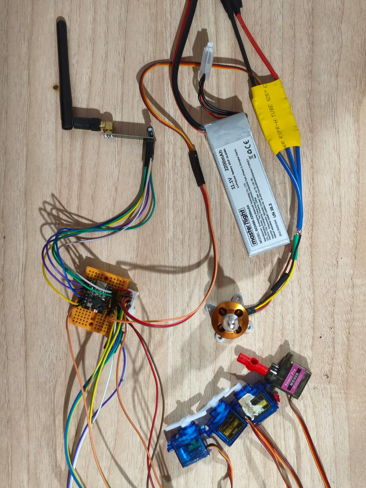
</p>
</details>

## 💻 Software

Two PlatformIO firmwares sharing one byte-identical protocol header (12-byte `RcPacket`,
CRC-8 on top of the nRF24's CRC-16, version nibble so mismatched firmware cannot half-work).

<p align="center">
  <picture>
    <source media="(prefers-color-scheme: dark)" srcset="docs/images/ui_3ch_dark.jpg">
    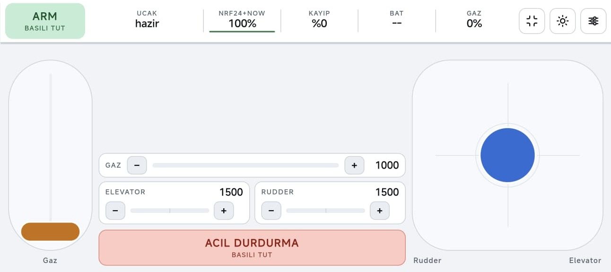
  </picture>
  <br><sub>3 CH layout on the phone — aircraft ready, both radios up (<code>NRF24+NOW 100%</code>), no packet loss.</sub>
</p>

<details>
<summary>4-channel layout and the settings screen</summary>
<br>
<p align="center">
  <picture>
    <source media="(prefers-color-scheme: dark)" srcset="docs/images/ui_4ch_dark.jpg">
    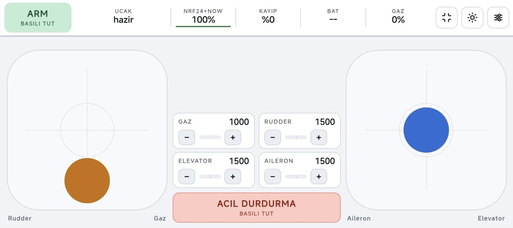
  </picture>
  <br><sub>Mode 2 with ailerons enabled: two full gimbals, four trim rockers.</sub>
  <br><br>
  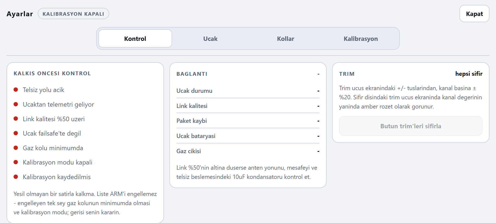
  <br><sub>Settings, rendered from the firmware's own page with no aircraft connected — hence the red checklist.</sub>
</p>
</details>

### Safety — enforced independently on both boards

* **Arm interlock.** The aircraft boots locked and re-locks after every failsafe; it arms
  only after seeing `ARMED = 0` first, so a recovering link can never spin the motor.
* **Telemetry-gated arming.** The ground station will not arm without fresh telemetry —
  "controller says ARMED, aircraft never heard it" cannot happen.
* **Two-stage throttle ceiling.** Both sides clip against their own stored limit; the lower
  one wins. Set from the UI, no recompiling.
* **Failsafe.** 500 ms without a valid packet → ESC stop pulse, surfaces to *calibrated*
  neutral, arm dropped. Leaving it takes 10 consecutive good packets, so a twitching link
  doesn't stutter the motor.
* **Browser watchdog.** The 20 Hz stick push is the watchdog feed: close the tab or walk out
  of WiFi range and the ground station disarms within 1 s.
* **Duplicate suppression.** Both radios feed one `paketIsle()`; a packet seen twice is
  dropped by its `seq`, so outputs and telemetry are never doubled and the rules cannot drift
  apart between paths.

### Engineering notes

* **Direct LEDC servo output, no `ESP32Servo`** — microseconds end to end, same unit as the
  wire protocol. Runs at 14-bit resolution (~1.22 µs) because the C3 it started on silently
  fails at the 16 bits most examples use.
* **Non-blocking transmit** — `startWrite()` plus STATUS polling instead of `radio.write()`,
  which burns ~12 ms of the 20 ms frame when the link drops.
* **Broadcast telemetry, measured** — unicast gave `ack=0 / nack=57` and then
  `ESP_ERR_ESPNOW_NO_MEM`, because the aircraft is not associated with the AP. Broadcast
  needs no ACK; the payload carries its own magic byte and CRC.
* **Dependency-free WebSocket server** (`mini_ws.h`, SHA-1 and base64 included) —
  `WebServer` closes every connection, which made 20 Hz sticks jitter. Sends are gated by a
  zero-timeout `select()` so the flight loop never waits on a stalled socket.
* **Over-the-air servo calibration in NVS** — direction, sub-trim and per-side endpoints,
  retransmitted until acknowledged and read back from the aircraft, so the screen shows what
  was *applied*.
* **Honest sticks** — throttle engages only from the knob (no jumps), a finger sliding off
  the well freezes the value instead of tracking the edge, and every colour pair clears WCAG
  AAA for direct sun. USB gamepads work via the Gamepad API.
* **Self-healing radio** — `radio.begin()` retries every 3 s from a live register read, so a
  reseated wire recovers without a reset.

### Testing & diagnostics

```bash
cd firmware && node tools/run_all.mjs                       # UI harness, no hardware
cd controller_software && pio run -e rfdiag -t upload -t monitor   # raw-SPI nRF24 diagnosis
cd ../flight_software  && pio run -e bench  -t upload -t monitor   # servos/ESC from serial, no radio
```

The harness reads the firmware sources directly: stick maths, UI vs firmware throttle
formula at 42 000 points (the ARM threshold depends on it), the page's JavaScript against a
fake DOM, WCAG contrast in both themes, every `#id` present. `rfdiag` bypasses RF24 and
brute-forces all 12 pin-order combinations to find swapped wires.
[`sim_middleware`](firmware/sim_middleware/) is meant to turn the phone UI into a vJoy joystick
for simulator practice with the same controls — written, not yet tested against a simulator.

## Getting Started

**Needs:** [PlatformIO](https://platformio.org/) (RF24 is pulled automatically). Optional:
Node 24+ and Python 3.11 for the test harness.

```bash
git clone https://github.com/erayfazilordanuc/rc-plane.git
cd rc-plane/firmware/flight_software     && pio run -t upload -t monitor   # aircraft
cd ../controller_software                && pio run -t upload -t monitor   # ground station
```

Both `platformio.ini` files pin their serial port (`COM5` ground station, `COM6` aircraft)
because the two USB bridges look alike and PlatformIO would otherwise flash the wrong board.
Check yours with `pio device list`, one board at a time.

1. Power the ground station, join **`RC-Plane-TX`** / `rcplane1234` from a phone and open
   **`http://192.168.4.1`**.
2. Pick a layout — **Mode 1**, **Mode 2** (default) or **3 CH**. Elevator and rudder spring
   back; throttle stays put like a ratcheted stick.
3. **Settings → calibration:** set direction, neutral and endpoints per surface, sweep,
   **save to the aircraft**.
4. The pre-flight checklist shows exactly what is blocking ARM. **Remove the propeller for
   every bench test.**

Bench keys: `W`/`S` throttle, arrows elevator, `A`/`D` rudder, `Space` emergency stop,
`X` throttle cut.

```
airframe/  avionics/  cad/print_files/   photos, printable STLs
docs/       RF_PROTOCOL.md · AIRFRAME.md · ROADMAP.md (Turkish) · diagrams/ · images/
firmware/   controller_software/ · flight_software/ · tools/ · sim_middleware/
```

Per-firmware READMEs: **[ground station](firmware/controller_software/)** ·
**[aircraft](firmware/flight_software/)**. Deep-dives in `docs/` and source comments are in
Turkish.

## 🧪 Flight Tests

**What happened.** Hand launches from a ploughed field, first on **21 September 2026**, then
in a later session. The radio side worked every time; the airframe did not stay up. Every
launch was at full stick with default settings and a calibrated ESC — in the firmware that is
a 2000 µs pulse with nothing else limiting it (`gazUs()` on the ground station, `escYaz()`
on the aircraft).

| Launch | What the video shows (frame-counted) |
|---|---|
| Best, 21 Sep | Leaves the hand, climbs a little, then loses height slowly and cannot be held up — about ten seconds (clip at the top). The pilot's read: wind helped |
| Soft, nose-high | Released slow with the nose up, drops a wing, on the ground **1.2 s** after release |
| Lobbed upward | Thrown steeply up by the pilot, phone in the other hand; climbs a few metres, settles back, on the ground **~4.5 s** after release |

<p align="center">
  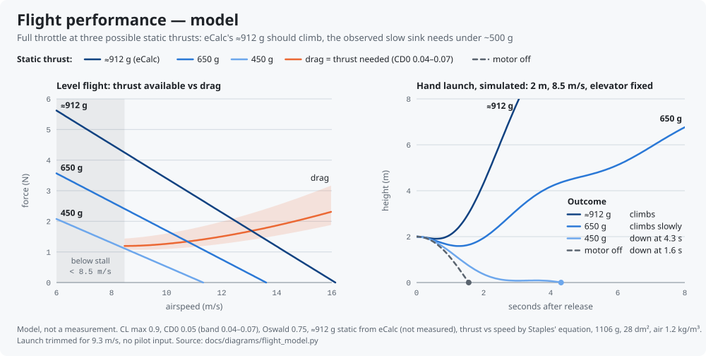
</p>

**What the model says.** A point-mass model, not a measurement —
[`flight_model.py`](docs/diagrams/flight_model.py), assumptions under the chart. Static thrust
comes from an eCalc run of this drive (below); how it falls off with speed comes from
Staples' propeller equation.

| | |
|---|---|
| Stall speed | ≈ 8.5 m/s |
| Minimum-drag speed | ≈ 8.4 m/s — the same as stall |
| Pitch speed, 10×4.5 | ≈ 16 m/s; at 10 m/s the prop gives 38 % of its static thrust |
| Full throttle, ≈ 912 g static (eCalc) | Level flight at 8.5–13.1 m/s, best climb ≈ 2.4 m/s |
| Static thrust below which height cannot be held | ≈ 440–500 g (thrust/weight 0.4–0.45) |

**Cross-check: eCalc.** I ran the same drive in [eCalc propCalc](https://www.ecalc.ch/)
(A2212 1000 KV, 10×4.5, 3S 2200 mAh 30C, 1105 g):

| | eCalc |
|---|---|
| Full throttle | 15.1 A, 10.5 V, 161 W, 8 680 rpm — 6.9 C on the pack, motor 82.5 % efficient |
| Static thrust | ≈ 912 g, thrust/weight 0.83 |
| Pitch speed | 60 km/h (16.7 m/s) |
| Stall / level speed | 30 km/h (8.3 m/s) / 68 km/h (18.9 m/s) |
| Rate of climb | 4.5 m/s |
| Flight time | 7.4 min at full throttle, 10.6 min mixed |

eCalc agrees on stall and pitch speed and is more optimistic than my model about the rest
(4.5 against 2.4 m/s climb). The conclusion doesn't depend on which is right: on paper,
this drive climbs.

* **Paper and field disagree — that is the finding.** With ≈ 912 g static both models
  climb away at full throttle. The aircraft didn't. The model reproduces the slow sink
  only if the motor makes less than ~500 g static, or if the wing is flying past its stall,
  where drag is far beyond this model (attached flow would need CD0 ≈ 0.3).
* **Power or speed?** The sink happens at low speed: the aircraft never gets clear of stall
  speed. What holds it there is the open question — too little thrust to accelerate, or a
  wing held at too high an angle (nose-high release, up elevator) that drags too much to
  accelerate. One measurement separates them: static thrust around 800 g or more clears the
  power train; around 500 g or less convicts it.
* **No speed margin.** Minimum-drag speed sits on top of stall speed, so anything that slows
  the aircraft — a soft throw, a nose-high release, pulling elevator to stop a sink — raises
  drag and deepens the sink. A 7 m/s throw starts below stall.
* **Wind — the best flight may have been luck.** Launched into a headwind, the aircraft
  leaves the hand with the throw *plus* the wind as airspeed, and a gust adds more for a
  moment. With stall and minimum-drag speed on top of each other, a lull is enough to drop it
  back into the sink. What wind can't do: a steady wind doesn't change airspeed once the
  aircraft is flying, and turning downwind costs groundspeed, not airspeed — only rising air
  holds a sinking aircraft up. Wind wasn't measured, so this stays a hypothesis.
* **It cannot glide out of trouble.** From 2 m with the motor off the model is on the ground
  in 1.6 s. Ten seconds in the air means the motor was pulling — without enough margin.

**What I got wrong.**
* Designed with static numbers — thrust/weight, tail volumes, CG — and never plotted thrust
  against drag at flight speed.
* Never measured the thrust. The 0.83 thrust/weight is eCalc's estimate, and "it rolls
  forward on the ground" only shows that thrust beats ground friction — a fraction of the
  weight.
* Weight grew 13 % (976 → 1106 g), wing loading 35 → 39.5 g/dm²; the margin was not
  re-checked.
* Launches were soft or nose-high, one of them one-handed.
* The docs recommend a 70–80 % throttle limit for first flights — wrong for this margin
  (the tests were flown at 100 %).
* Flew without data: no flight log, no fixed camera, no measured thrust, no wind reading.
  Every number above
  is a model until one of those exists.

**Proposed fixes, checked against the model.** An outside review of the first flights
suggested these:

| Proposal | Verdict |
|---|---|
| 9×6 prop instead of 10×4.5 | **Helps** — pitch speed 16 → 22 m/s, best climb 2.4 → 2.7 m/s (rpm assumed — to be run in eCalc). Check current draw |
| 1300–1500 mAh battery instead of 2200 | Small — about −80 g, stall −4 %; CG must be re-balanced |
| Rebuild at 750–800 g (bare foam or XPS) | **Biggest lever** — stall 7.0–7.2 m/s, wing loading 27–29 g/dm² |
| Clark Y / NACA 4412 instead of KFm-2 | Plausible, less drag; a new wing, so after the cheap fixes |
| Fin +15–20 % against spiral dives | **Not supported.** Vv 0.036 is within the usual 0.02–0.05. A bigger fin makes spiral divergence *more* likely, not less; strong dihedral with a small fin leans toward Dutch roll. Needs a stability analysis |
| Expo / deadband on the touch rudder | Expo is already there (25 % default); a deadband is not — cheap to add |

## Next Steps

### Without new parts

In this order — each result goes back into the model and this README.

1. **Static thrust** — tie the tail to a luggage scale anchored to a post, aircraft on a
   smooth floor, full throttle for a few seconds. Or stand it tail-down on a kitchen scale,
   held upright without pressing: weight minus reading = thrust. eCalc says ≈ 912 g.
2. **RPM and battery sag** — record the prop with [phyphox](https://phyphox.org/) (audio
   spectrum); RPM = blade-pass frequency × 30 for a two-blade prop, the model assumes
   ≈ 8 680. If a multimeter is at hand, read pack voltage at full throttle.
3. **Prop check** — size lettering and the curved face toward the front, nothing rubbing,
   air blown backwards. A prop mounted backwards loses much of its thrust.
4. **Launch drill** — full throttle before release, into the wind, wings level, nose on the
   horizon, a firm throw straight ahead. One person throws, the other flies. Don't pull while it sinks; let
   it gain speed.
5. **Fixed camera and wind** — tripod, side-on, 60 fps, two markers a known distance apart,
   a tape streamer on a stick in frame. [Tracker](https://physlets.org/tracker/) turns the clip
   into groundspeed and sink rate; with the wind, that is airspeed — the first measured numbers
   for the model. For 21 September, look up the hourly wind at the field in
   [Open-Meteo's historical data](https://open-meteo.com/en/docs/historical-weather-api).
6. **XFLR5** — model wing and tail in [XFLR5](http://www.xflr5.tech/) at Re ≈ 130 000: real
   polars instead of assumed drag and CL max, the static margin, and the dynamic modes
   (spiral, Dutch roll) that settle the fin question.
7. **eCalc, 9×6** — the 10×4.5 run is above; run 9×6 on the same drive for thrust, current
   and pitch speed before buying one.
8. **Simulator** — first check that [`sim_middleware`](firmware/sim_middleware/) works at all
   (untested). Then build this aircraft in RealFlight (1106 g, 1.4 m, 28 dm², 10×4.5,
   1000 KV) and practise launches.
9. **Flight log** — the ground station writes every frame to CSV, downloadable from the UI
   ([ROADMAP §4](docs/ROADMAP.md)).
10. **Rudder deadband** in the touch UI.

### Needs parts

* **9×6 prop** — more thrust at flying speed whatever step 1 shows.
* **Soldered board** — the electronics still sit on a breadboard inside the fuselage.
* **Battery telemetry** — `bataryaOku()` returns 0 today; needs a divider on an ADC1 pin.
* **Physical sticks** and **range testing** under real separation.
* **A lighter airframe** if the prop change is not enough.

Longer plan — link authentication, IMU stabilisation: **[docs/ROADMAP.md](docs/ROADMAP.md)**
(Turkish).
