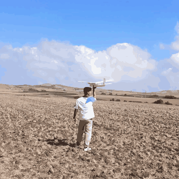
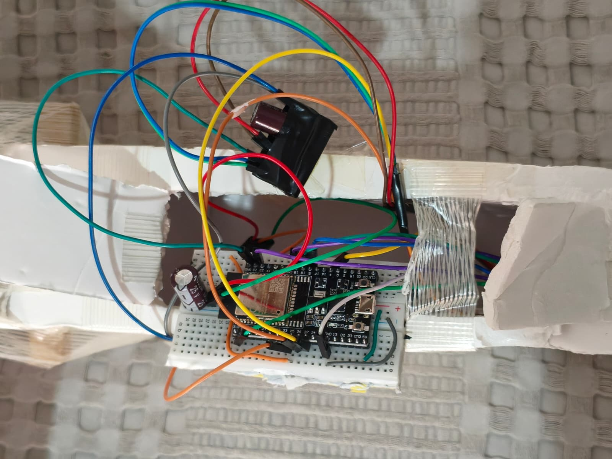

# ESP32 RC Plane

<p align="center">
  
</p>

A from-scratch radio control system for a fixed-wing aircraft, built on two ESP32 boards
instead of a commercial TX/RX pair. There is no hobby transmitter in this project: the
ground station generates the RC frame itself, and the aircraft decodes it, drives the
surfaces and reports back — over a **redundant dual radio link** with failsafe logic on
both ends. The airframe is scratch-built too: a 1.4 m foam-board trainer cut by hand from
a paper plan.

The interesting part of this build is not that it moves a servo. It is everything that
happens when the link degrades: duplicate suppression, arm interlocks, relink hysteresis
and independent throttle ceilings on both sides.

<p align="center">
  
  <br><sub>First field test, 21 September 2026 — hand launch and about ten seconds of flight.</sub>
</p>

## 🛰️ System Overview

```
┌──────────────────────────────┐            ┌──────────────────────────────┐
│  GROUND STATION (TX)         │            │  AIRCRAFT (RX)               │
│  ESP32-WROOM-32              │            │  ESP32 DevKitC (WROOM-32D)   │
│                              │            │                              │
│  WiFi AP ──► web UI          │  RcPacket  │  paketIsle()                 │
│  192.168.4.1   ┌──────────┐  │ ══ 50 Hz ═►│  ├─ verify (magic + CRC)     │
│                │ nRF24L01 │──┼─ 2.508 GHz │  ├─ arm interlock            │
│                └──────────┘  │            │  ├─ failsafe                 │
│                ┌──────────┐  │            │  └─ LEDC ──► ESC + 2 servos  │
│                │  ESP-NOW │──┼─ 2.412 GHz │                              │
│                └──────────┘  │◄═ telemetry│  RcTelemetry (8 B)           │
└──────────────────────────────┘            └──────────────────────────────┘
```

The operator's phone connects to the ground station's own access point and flies the
aircraft from a browser — **two touch gimbals laid out like a real transmitter**, no
internet, no pairing app. The ground station turns that into a 12-byte `RcPacket` at
50 Hz and pushes it over the air.

The airframe is a **3-channel trainer**: throttle, elevator and rudder. There are no
ailerons — roll comes from rudder via wing polyhedral, which is why the spare stick axis is
drawn as a single-axis slot in the UI rather than being silently dead. The protocol already
carries a fourth channel: switch Settings to **4 channel** and both sticks become full
gimbals, and the aircraft drives mirrored aileron servos on GPIO 32/33 — a new wing needs
no firmware change.

## 📡 Redundant Dual Transport

The same `RcPacket` travels over **two fully independent radio paths**, and either one
alone is enough to fly:

| | nRF24L01+ | ESP-NOW |
|---|---|---|
| Hardware | Separate module, SPI, 7 wires + capacitor | **None** — the chip's own WiFi radio |
| Frequency | 2.508 GHz (channel 108) | 2.412 GHz (WiFi channel 1) |
| Addressing | `"RCP01"` pipe | Broadcast — no MAC pairing needed |
| Telemetry | ACK payload | Separate broadcast frame |

The 96 MHz gap between the two is deliberate — the access point cannot desensitise the
nRF24 link. Both paths funnel into the same `paketIsle()` entry point on the aircraft, so
validation, arming and failsafe rules exist in exactly one place and cannot drift apart.
When a packet arrives twice, the `seq` delta is 0 and the duplicate is dropped: outputs are
never written twice and telemetry is never sent twice.

This redundancy was not academic. The nRF24 path was dead for a stretch during bring-up
(brown-out on transmit, and a clone chip silently refusing 250 kbps) — ESP-NOW kept the
aircraft controllable while that was diagnosed.

## 🛡️ Safety Architecture

Every guard below is enforced **independently on both boards**. Trusting the transmitter's
limits alone means a corrupted packet or a stale browser tab can spin a propeller.

* **Arm interlock.** The aircraft boots arm-locked and re-locks after every failsafe. It
  will not arm until it has seen a packet with `ARMED = 0` from the ground station — so a
  recovering link can never spin the motor on its own; the operator must cycle DISARM → ARM.
* **Telemetry-gated arming.** The ground station refuses to arm unless fresh telemetry is
  coming back from the aircraft. The "controller says ARMED but the aircraft never heard it"
  state is structurally impossible.
* **Two-stage throttle ceiling.** The ground station scales throttle by a pilot-set limit,
  and the aircraft clips again against its own stored ceiling. Neither side trusts the
  other's number; the lower one wins. Both are adjustable from the UI, so bringing a new
  setup up at 70 % no longer means recompiling.
* **Failsafe.** No valid packet for 500 ms → throttle to the ESC stop pulse, all surfaces to
  their calibrated neutral, arm dropped.
* **Relink hysteresis.** Leaving failsafe requires 10 consecutive valid packets (~200 ms at
  50 Hz). Recovering on a single packet made the motor stutter every time the link twitched.
* **Browser watchdog.** The UI pushes stick positions at 20 Hz, and that push *is* the
  watchdog feed. Close the tab, background the app or walk out of WiFi range and the ground
  station disarms within 1 second, with the aircraft's own failsafe firing 500 ms later.
* **Calibration is motor-safe.** Entering servo calibration is refused while armed, and the
  mode itself makes arming impossible and pins the ESC at its stop pulse. Endpoint tests
  return to neutral after 4 seconds, so a servo cannot sit stalled against a linkage stop.
* **CRC-8 on every frame**, on top of the nRF24's hardware CRC-16, plus a protocol version
  nibble so mismatched firmware cannot half-work.

## ✈️ Airframe

<p align="center">
  
</p>

| | |
|---|---|
| **Construction** | Foam board (*fotoblok*) with a wooden spar, KFm-2 stepped airfoil, tape hinges |
| **Wing** | 1400 mm span, 200 mm constant chord, 28 dm², high wing |
| **Roll stability** | 8° polyhedral breaks at ±320 mm — roll comes from rudder |
| **Tail** | 400 × 150 mm stabiliser, 180 mm fin |
| **CG** | 50 mm behind the leading edge, on the spar line (25 % chord) |
| **Power** | A2212 1000 KV outrunner, 10×4.5 prop, 3S 2200 mAh LiPo |
| **Weight** | ≈ 976 g estimated, 35 g/dm² wing loading |

The full build plan — cut list, sheet nesting for 50 × 70 cm foam board, spar layout,
weight budget and build order — is in **[docs/AIRFRAME.md](docs/AIRFRAME.md)** (Turkish).
These are design values; the finished aircraft has not been weighed into the table yet.

## ⚡ Hardware

<p align="center">
  
  
</p>

**Aircraft — ESP32 DevKitC (38-pin, WROOM-32D).** The first bench prototype ran on an
ESP32-C3 SuperMini; the aircraft that flies carries a classic ESP32. Both ends now share
one radio pin map (VSPI on 18/19/23, CSN 5, CE 4), so a wiring fix on one board is a
wiring fix on the other.

**Ground station — ESP32-WROOM-32.** Runs the WiFi access point, the web server and the
radio at the same time. The dual-core part keeps HTTP work from stalling the 50 Hz frame.

**nRF24L01+ PA/LNA with an external SMA antenna at both ends**, running at `RF24_PA_HIGH`.
If a module resets under load, check its capacitor and supply before suspecting anything
else — the firmware counts every recovery (`kurt=N` / `kurtarma=N`) so a brown-out cannot
hide.

**Power.** 3S 2200 mAh LiPo → ESC → A2212 1000 KV outrunner. There is no separate UBEC: the
ESC's BEC output feeds the board's 5 V pin and both servos, with a bulk capacitor across
that line. A 9 g servo pulls ~700 mA on a step input, so if the boot log ever shows
`BROWNOUT`, check that capacitor and the ground first — and give the servos their own UBEC
if it persists. Grounds are common. The ground station runs off an 18650 pack in a
3D-printed enclosure.

> ⚠️ **The nRF24 needs a 10–100 µF capacitor across VCC–GND, as close to the module pins as
> possible.** Without it the module browns out during transmit and `radio.begin()` succeeds
> only sometimes — the most misleading failure mode in this whole build.
>
> ⚠️ **nRF24 VCC is 3.3 V, never 5 V.** The header is 2×4 with GND on pin 1 and VCC on pin 2;
> it is very easy to be one row off, and reversed supply kills the module.

### Wiring

<p align="center">
  
</p>

<p align="center">
  
</p>

| Aircraft (ESP32 DevKitC) | GPIO | | Ground station (ESP32) | GPIO |
|---|---|---|---|---|
| ESC signal | 25 *(10 k to GND)* | | nRF24 CE | 4 |
| Elevator | 26 | | nRF24 CSN | 5 |
| Rudder | 27 | | nRF24 SCK | 18 |
| nRF24 SCK / MISO / MOSI | 18 / 19 / 23 | | nRF24 MISO | 19 |
| nRF24 CSN / CE | 5 / 4 | | nRF24 MOSI | 23 |

On the classic ESP32, GPIO 0, 2, 12 and 15 are strapping pins — a pull-down on GPIO0 drops
the board into the bootloader on every power-up, which is why the ESC left GPIO0 when the
aircraft moved off the C3. GPIO 14 pulses during boot and 6–11 belong to the internal flash
(silkscreened `D0–D3`, `CMD`, `CLK` — `D2` is *not* GPIO2), so none of them are used. The
10 k on the ESC line keeps the pin from floating garbage into the ESC while the board boots.
GPIO 32/33 still carry mirrored aileron outputs in firmware; nothing is connected to them on
this airframe.

The diagrams are generated by [`docs/diagrams/generate.py`](docs/diagrams/generate.py).
Wire-by-wire tables with cable colours live in each firmware's `docs/kablolama.html` and in
**[docs/RF_PROTOCOL.md](docs/RF_PROTOCOL.md)**.

## 💻 Firmware

* **Direct LEDC servo driving — no `ESP32Servo`.** The library's pin allowlist rejects GPIO0,
  and its degree↔µs conversion shifted the neutral point. Writing LEDC duty directly means
  the firmware speaks the same unit as the wire protocol: microseconds, end to end, with no
  conversion anywhere.
* **The 14-bit C3 trap.** The ESP32-C3's LEDC timer maxes out at 14 bits, while nearly every
  example online uses 16 (valid on the classic ESP32). Copy those verbatim and `ledcSetup()`
  silently returns 0, no PWM is generated at all, and a multimeter reads 0 V on the pin.
  The firmware started on a C3 and still runs at 14 bits: @ 50 Hz that is ~1.22 µs
  resolution — well past what RC needs — and it keeps working if the board ever goes back.
* **Non-blocking transmit.** The ground station uses `startWrite()` plus STATUS polling rather
  than `radio.write()`. Blocking writes burn ~12 ms of the 20 ms budget when the link drops,
  making the UI sluggish exactly when control matters most. A transmit exceeding 15 ms is
  aborted and the TX FIFO flushed.
* **Broadcast telemetry, and why not unicast.** Unicast was tried and measured out:
  `ack=0 / nack=57` — not one of 57 sends per second was acknowledged, then
  `ESP_ERR_ESPNOW_NO_MEM`. The aircraft's STA is not associated with the ground station's
  AP, so its unicast frames get no MAC-layer ACK; ESP-NOW retries, the send queue fills,
  and telemetry stops entirely. Broadcast frames expect no ACK and never fill the queue,
  and the payload carries its own magic byte and CRC-8, so nothing is lost by not being
  addressed.
* **Decoupled telemetry cadence.** Telemetry refreshes every 100 ms regardless of packet
  arrival, so duplicate-suppression gaps can't be misread as "the aircraft is not answering".
* **Servo calibration over the air, stored in NVS.** Direction, sub-trim and independent
  per-side endpoints live in the aircraft's flash rather than in a `#define`. They survive a
  reset, they can be set with the receiver buried in a fuselage and no USB attached, and
  failsafe neutral becomes the *calibrated* neutral instead of a hardcoded 1500 µs. Commands
  are retransmitted until the aircraft acknowledges them, and every value on screen is read
  back from the aircraft — you see what it applied, not what was sent.
* **ESC throttle range calibration**, from the serial port (`k` within 5 s of boot, then `e`
  to confirm each step) or from the UI behind a prop-removed confirmation. An uncalibrated
  ESC can still read 1200 µs as stop — the usual cause of "throttle is going out but the
  motor won't turn". The routine deliberately exceeds the throttle ceiling, so it is never
  reachable from flight code, and a single stray byte on the UART can never reach full
  throttle.
* **A dependency-free WebSocket server** (`include/mini_ws.h`, SHA-1 and base64 included).
  `WebServer` stamps `Connection: close` on every response, so 20 Hz stick updates meant a
  fresh TCP handshake per frame and visibly jittery surfaces. Sends are gated behind a
  zero-timeout `select()`: `WiFiClient::write()` can block for ~10 s on a stalled socket,
  and the flight loop must never be the thing that waits. The page falls back to HTTP
  polling if the socket cannot be established.
* **Self-healing radio.** Both sides retry `radio.begin()` every 3 s and report link state
  from a live register read, so a wire reseated mid-session recovers without a reset.

## 🚀 Getting Started

### Prerequisites
* [PlatformIO](https://platformio.org/)
* Libraries are pulled automatically: `nrf24/RF24@^1.4.11`
* Optional: Node 24+ and Python 3.11 for the UI test harness in `firmware/tools/`

### Build & flash

```bash
git clone https://github.com/erayfazilordanuc/rc-plane.git
cd rc-plane

# Aircraft
cd firmware/flight_software
pio run -t upload -t monitor

# Ground station
cd ../controller_software
pio run -t upload -t monitor
```

Both `platformio.ini` files **pin their serial port explicitly** — `COM5` for the ground
station's CP210x bridge, `COM6` for the aircraft. Both boards enumerate through a USB
bridge and look alike in Device Manager, and without a pinned port PlatformIO takes the
first one in the list and flashes the wrong board. Check yours with `pio device list`,
one board attached at a time, and update the lines.

### Fly it

1. Power the ground station and connect a phone to **`RC-Plane-TX`** / `rcplane1234`.
2. Open **`http://192.168.4.1`**.
3. Two gimbals in the **bottom corners**, each at least 140 dp on a side. A 3-channel
   airframe has no ailerons, so one horizontal axis is always spare and three layouts pick
   where it sits: **Mode 1** (left: rudder + elevator, right: throttle), **Mode 2**
   — the default — (left: rudder + throttle, right: elevator), and **3 CH**
   (left: throttle only, right: rudder + elevator). Elevator and rudder spring back to
   centre on release; throttle stays where you left it, exactly like a ratcheted stick.
   With **4 channel** selected, Mode 1 and Mode 2 become full two-gimbal layouts and 3 CH
   disappears, since no axis is spare any more.
4. Calibrate the servos before the first flight: **Settings → enter calibration**, set
   direction, neutral and endpoints per surface, sweep to confirm nothing binds, then
   **save to the aircraft**.

<p align="center">
  <picture>
    <source media="(prefers-color-scheme: dark)" srcset="docs/images/ui_3ch_dark.jpg">
    
  </picture>
  <br><sub>3 CH layout on the phone — aircraft ready, both radios up (<code>NRF24+NOW 100%</code>), no packet loss.</sub>
</p>

<details>
<summary>4-channel layout (Settings → 4 channel) and the settings screen</summary>
<br>
<p align="center">
  <picture>
    <source media="(prefers-color-scheme: dark)" srcset="docs/images/ui_4ch_dark.jpg">
    
  </picture>
  <br><sub>Mode 2 with ailerons enabled: two full gimbals, four trim rockers.</sub>
  <br><br>
  
  <br><sub>Settings, rendered from the firmware's own page with no aircraft connected — hence the red checklist.</sub>
</p>
</details>

The throttle stick cannot jump. Axes map absolutely — stick position *is* the channel
value — but the throttle axis only engages when the touch starts on the knob, so tapping
the top of the well does nothing. Spring-loaded axes need no such guard; they re-centre on
release.

Slide a finger off the well and the value **freezes** rather than tracking a clamped
edge — a stick that keeps moving while your finger is somewhere else is a lie. The well
border turns amber while frozen, and spring-loaded axes still re-centre on release.
Multi-touch is per gimbal via pointer capture, so "released" and "dragged outside" never
get confused. A USB gamepad works too, through the Gamepad API.

Stick data is sent **on the touch event itself**, not on a timer, so the UI adds no
buffering of its own; end-to-end latency is essentially the radio's own 20 ms frame.
A screen Wake Lock keeps the display on, and pulling down the notification shade does not
disturb a single channel. The flight screen carries no animation, transition, gradient or
shadow, and every colour pair on it clears WCAG AAA against its background so it stays
readable in direct sun.

Keyboard, for bench work: `W`/`S` throttle, arrows elevator, `A`/`D` rudder, `Space`
emergency stop, `X` throttle cut.

The pre-flight check list in Settings shows exactly what is blocking ARM. **Remove the
propeller for every bench test.**

## 🔧 Diagnostics & Tests

Two extra PlatformIO environments exist for isolating faults:

```bash
# Raw-SPI nRF24 diagnosis: shorts, MISO drive, pin-order permutations, speed sweep
cd firmware/controller_software
pio run -e rfdiag -t upload -t monitor

# Servo/ESC bench: no radio at all, drive the outputs from the serial port
cd firmware/flight_software
pio run -e bench -t upload -t monitor
```

`rfdiag` bypasses the RF24 library entirely and brute-forces all 12 SCK/MISO/MOSI and CE/CSN
combinations, so it reports the correct wiring order if the wires got swapped. If the
registers it reads are bit-shifted copies of each other, the MISO line is floating and the
module is not answering at all.

The phone interface has a hardware-free test harness that reads the firmware sources
directly:

```bash
cd firmware
node tools/run_all.mjs
```

It checks the stick maths, that the UI's throttle formula matches the firmware's at 42 000
points (the ARM threshold depends on it), that the page's JavaScript runs start to finish
against a fake DOM, WCAG contrast in both themes, and that every `#id` the script looks up
exists in the HTML.

**Simulator practice.** [`firmware/sim_middleware`](firmware/sim_middleware/) turns the same
phone interface into a virtual USB joystick (vJoy) on a PC, so RealFlight and similar
simulators can be flown with exactly the controls used in the field.

## 📂 Directory Structure

```
airframe/           photos of the aircraft and the first flight
avionics/           electronics photos; legacy/ keeps the ESP32-C3 bench prototype
cad/print_files/    STLs: ground station housing and lid, firewall
docs/
  RF_PROTOCOL.md    radio protocol report: packet layout, failsafe, wiring, bring-up (Turkish)
  AIRFRAME.md       airframe build plan: dimensions, cut list, weight budget (Turkish)
  diagrams/         wiring and airframe SVGs + the script that generates them
  images/           interface screenshots
firmware/
  controller_software/   ground station: WiFi AP, phone UI, 50 Hz frame builder, RF diagnostics
  flight_software/       aircraft: dual-radio receive, arm interlocks, failsafe, NVS calibration
  tools/                 UI test harness (node tools/run_all.mjs)
  sim_middleware/        phone UI → vJoy bridge for PC flight simulators (Python)
```

Each firmware has its own README with the wiring, the design decisions and the log format:
**[ground station](firmware/controller_software/)** · **[aircraft](firmware/flight_software/)**.

<p align="center">
  
</p>

> The engineering deep-dives in `docs/`, the per-firmware wiring pages and the source
> comments are written in Turkish.

<details>
<summary>Earlier prototype: ESP32-C3 SuperMini on the bench</summary>
<br>
<p align="center">
  
</p>
</details>

## 🧭 Status & Next Steps

The link, the web UI, failsafe and the full actuation chain are installed in the airframe.
First field tests took place on **21 September 2026**: hand launches from a ploughed field,
the best of them about ten seconds in the air (clip at the top). Open items:

* **Trim and CG** — tune from the first flights; weigh the finished aircraft and replace the
  estimates in `docs/AIRFRAME.md` with measured values.
* **Soldered board** — the electronics still sit on a breadboard inside the fuselage.
* **Battery telemetry** — `bataryaOku()` returns 0 today; the ground station's voltage field
  lights up as soon as a divider is wired to an ADC1 pin.
* **Physical sticks** — a gimbal-based transmitter to replace the browser UI as primary control.
* **Range testing** and PA level tuning under real separation.
