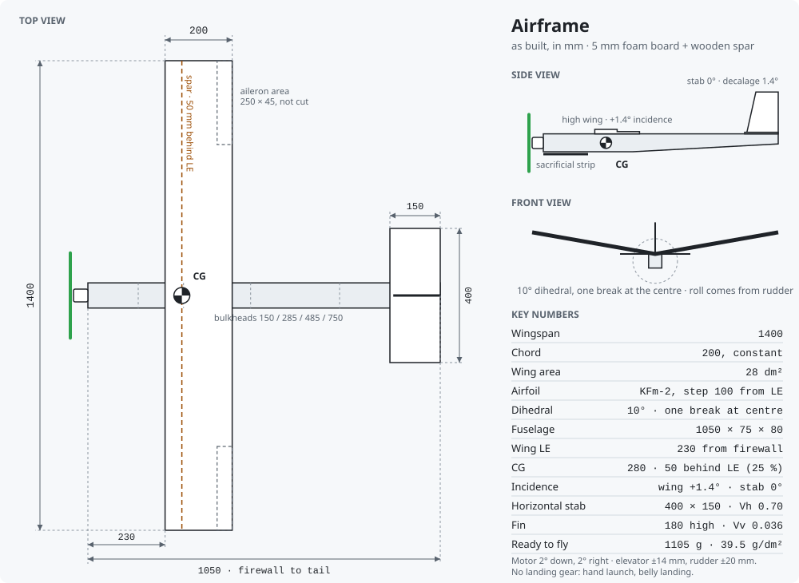

# RC Plane — Mekanik Tasarım Kararları

3 kanallı (gaz, elevator, rudder) eğitim uçağı. 5 mm fotobloktan elde kesildi.
Aileron yok: yatış, kanadın dihedral kırımı ve rudder ile sağlanıyor.

Aşağıdaki değerler **yapılmış uçağın** değerleri. İlk tasarım planından üç önemli fark var:
polihedral (640/380 bölünmesi) terk edildi ve dihedral tam ortaya alındı, kanat hücum kenarı
montajda 285 yerine 230'a geldi, uçuşa hazır ağırlık 976 g tahmini yerine **1105 g** çıktı.

Tüm ölçüler mm. Sıfır noktası firewall.

---

## 1. Kanat

| | |
|---|---|
| Açıklık / veter | 1400 / 200 sabit |
| Alan | 28 dm² |
| Plan | Dikdörtgen, sivrilme yok |
| Dihedral | **10°**, tam ortadan tek kırım — uçta ≈ 123 mm yükselme |
| Profil | KFm-2, basamak hücum kenarından 100 mm (%50 veter) |
| Kalınlık | Ön yarı 10 mm, arka yarı 5 mm |
| Kiriş | Hücum kenarından 50 mm geride |

- Üst katman iki şeride bölünüp **çıta aralarına gömüldü**; üst ve alt çıta çifti birlikte
  I-kiriş gibi çalışıyor.
- Kökte kiriş bindirmesi en az 200 mm, alt ve üstte takviye plakası. Eğilme momenti en çok
  kökte, çift kalınlık oraya denk geliyor.
- **Alt yüz baştan sona şeffaf bantlı:** hem nem bariyeri hem burulma rijitliği.
- Aileron bölgesi (uçtan 250 × 45 mm) işaretlendi ama **kesilmedi**. Firmware ve protokol
  4 kanalı zaten destekliyor; kanat sonradan aileronlu hale getirilebilir.

## 2. Gövde

| | |
|---|---|
| Uzunluk | 1050 |
| Kesit | 75 × 80 |
| Kuyruk | Üst kenar düz; yükseklik alttan daralarak 45 mm'ye iniyor, genişlik sabit 75 |
| Firewall | 3 mm kontrplak, epoksi, 20 mm yuvaya oturuyor |

- Yan duvar eki **x=400**, üst güverte eki **x=600**. İkisi bilerek aynı istasyona
  getirilmedi; aynı kesitte buluşurlarsa gövde orada zayıflar.
- Kanat bölgesine (x=285–485) iç yüzden **çift kat doubler**.
- Ara bölmeler: **x=150, 285, 485, 750**.
- **İniş takımı yok:** elden fırlatma, karın inişi. Burun altına kurban şeridi ve bant.

## 3. Yerleşim ve denge

| | |
|---|---|
| Kanat hücum kenarı | x=230 *(tasarımda 285 idi, montajda 230'a geldi)* |
| **Ağırlık merkezi** | **x=280** — hücum kenarından 50 mm, veterin %25'i |

- **Batarya cırt bantla ayarlanabilir.** CG'nin tek düzeltme aracı bu; kurşun eklenmiyor.
- **Kanat gövdeye yapışık değil:** iki ahşap pim + kauçuk lastik. Sert bir inişte kanat
  yerinden çıkıyor — tasarlanmış kırılma noktası.

## 4. Açılar

| | |
|---|---|
| Kanat hücum açısı | +1,4° (5 mm takoz) |
| Yatay dengeleyici | 0° — dekalaj 1,4° |
| Motor | 2° aşağı, 2° sağ |

Firewall dik kesildi; motor açıları montaj pulu ile veriliyor.

## 5. Kuyruk

| | |
|---|---|
| Yatay | 400 × 150 (kanadın %21'i), **Vh = 0,70** |
| Elevator | Veterin %35'i = 52 mm |
| Dikey | 180 yükseklik, kök 140 / uç 100, **Vv = 0,036** |
| Rudder | 50 mm sabit genişlik, firar kenarı dik |
| Kuyruk momenti | ~630 mm = 3,1 × veter |

- **Menteşe:** iki yüzden 45° tıraş, tek taraftan bant.
- **Sapmalar:** elevator ±14 mm, rudder ±20 mm. Mekanik nötr ayarlı; ince ayar
  arayüzdeki servo kalibrasyonundan yapılıyor (yön, nötr, uç noktalar uçağın NVS'inde).

## 6. Güç sistemi

| | |
|---|---|
| Motor / pervane | A2212 1000 KV / 10×4.5 |
| ESC | 30 A |
| Batarya | 3S 2200 mAh 30C |
| 5 V | **Ayrı UBEC, 5 V / 3 A** — ESC'nin lineer BEC'i devre dışı |
| Akım hedefi | Tam gazda 25 A altı |

ESC'nin lineer BEC'i devre dışı bırakıldı; kart ve iki servo ayrı UBEC'ten besleniyor.
Bağlantı şeması: [`diagrams/aircraft_wiring.svg`](diagrams/aircraft_wiring.svg).

## 7. Malzeme ve yapım

- **5 mm kraft fotoblok**, 50 × 70 cm levha. Hiçbir parça 700 mm'yi geçmiyor; gövdenin uzun
  parçaları ekleme yapılarak elde edildi.
- **Sıcak silikon** ana yapıştırıcı; epoksi yalnızca firewall'da.
- **Ahşap çıta kiriş** (karbon yerine).
- Tutkal **köpük yüzeye** sürülüyor, kağıda değil.

Yapım sırası: test parçası (45° eğik kesim, çizik derinlikleri, bant menteşe) → 1:1 şablonlar
→ kanat panelleri ve çıta → ortadan dihedral kırımı → kök takviyesi → gövde yan duvarları,
ekler, doubler'lar, firewall → ara bölmeler → **UBEC hattını masada dene** → elektronik ve
üst güverte → kuyruk yüzeyleri → pushrod ve mekanik nötr → son CG ölçümü.

## 8. Kütle

| | |
|---|---|
| Uçuşa hazır | **1105 g** |
| Kanat yükü | 39,5 g/dm² |
| İtki/ağırlık | ~0,8 |

İtki/ağırlık 0,8 olduğu için dik tırmanış yok: elden fırlatmada burnu fazla kaldırmamak,
hızı toplamasını beklemek gerekiyor.

**CG kontrolü:** uçak bataryalı ve tam donanımlıyken, kanadın altından iki parmakla hücum
kenarından 50 mm geriden tut. Yatay durmalı ya da burnu hafif aşağı bakmalı. Kuyruk
düşüyorsa bataryayı öne kaydır.

---

## İlk plandan neler değişti

| Konu | Plan | Yapılan |
|---|---|---|
| Kanat kırımı | Polihedral, 640 + 380 panel, ±320'de kırım | 10° dihedral, ortadan tek kırım |
| Kanat hücum kenarı | x=285 | x=230 |
| 5 V | ESC'nin BEC'i | Ayrı UBEC 5 V / 3 A, ESC BEC devre dışı |
| Ağırlık | 976 g tahmini | 1105 g ölçülen |
| Kanat yükü | 35 g/dm² | 39,5 g/dm² |
